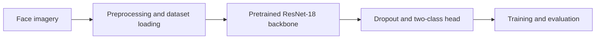

# Deepfake Face Detection

A study repository containing image-based deepfake-classification research code. The checked implementation uses **PyTorch and torchvision ResNet-18**, with a two-class classifier head.

## Attribution and scope

The nested research README credits **Dessa / Square**. Preserve its copyright, license, and original research attribution. This repository should not be read as a claim that I authored the upstream model or reproduced its published results. Personal extensions have not yet been separately documented.

## Architecture

See `Deepfake Face Detection/model.py` for the classifier. The source uses CUDA and provides alternate classifier-head configurations.

## Setup and evidence

Follow the nested README for the upstream environment, data preparation, and training entry points. Dataset access and licensing must be checked separately. No trained model, accuracy, real-time frame rate, or successful local reproduction is asserted here.

The previous root description referred to a CNN-LSTM, TensorFlow, and unsupported performance figures. Those claims have been removed because they do not match the inspected implementation.

## Limitations

This is an image-classification research study, not a reliable verdict on whether a video is authentic. Compression, unseen generation methods, and dataset bias can affect predictions. Evaluate on held-out data with documented provenance before drawing conclusions.
